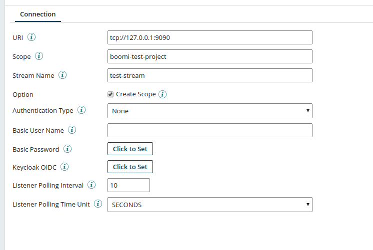
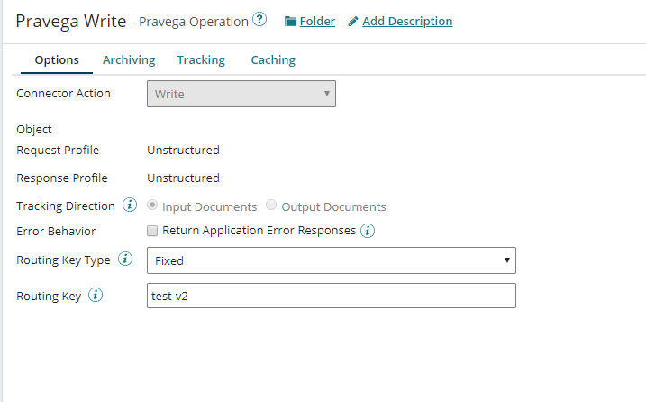
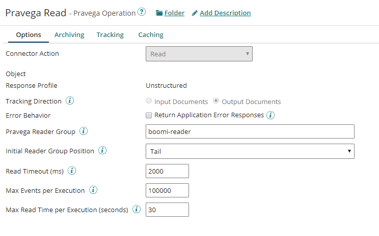
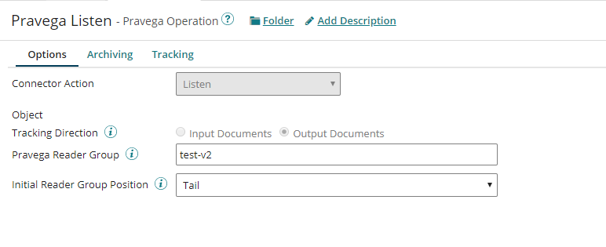
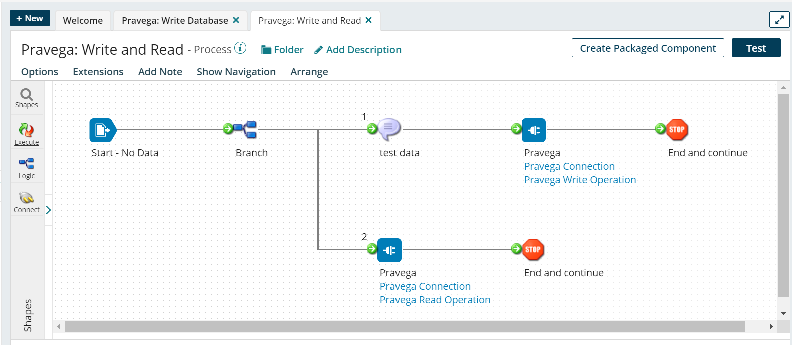
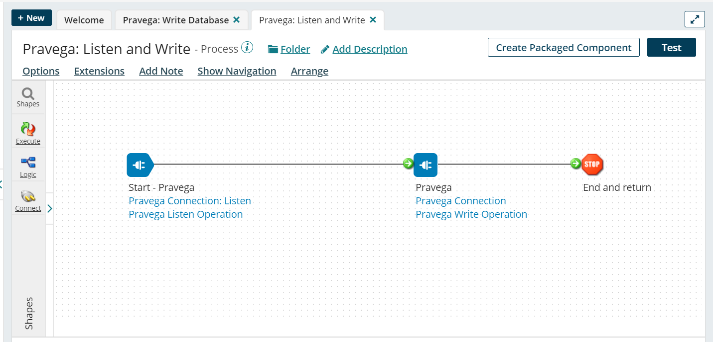
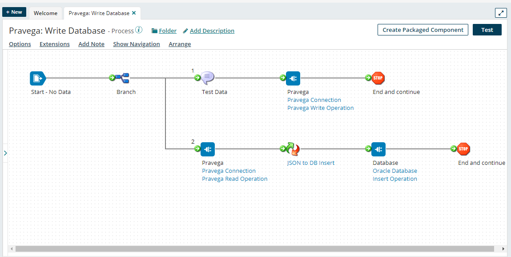

# Getting Started with the Pravega Connector

**Overview**

Pravega is a storage system that exposes Stream as the main primitive for continuous and 
unbounded data. A Pravega stream is a durable, elastic, append-only, unbounded sequence of 
bytes having good performance and strong consistency.

**Configure the Pravega Connector**

The Pravega connection represents and contains all the information that is needed to connect 
to and log in to a specific Pravega cluster. In this example we will create a new Pravega 
Connection. First, we need a running instance of Pravega. You can obtain this from the Project 
page in the SDP UI (if you are using SDP), or from your Pravega cluster configuration. For testing, you can 
start a local Pravega cluster. [Here](http://pravega.io/docs/latest/deployment/run-local/) is 
the documentation about how to run Pravega locally. We need to provide a URI endpoint of the 
Pravega controller in the form tcp://host:port, scope and stream name. If authentication is
required, then provide the Pravega username and password. If you will use any listener operations
with this connector, then you need to provide the desired listener time interval 
and time unit. When finished with the settings, we can check the connection using the Test Connection button.

In this example, we are running a Pravega stand-alone server locally on port 9090. We provide a scope, stream name and check the option to create this scope (the connector will automatically create the scope if it doesn't already exist) - note that this option cannot be used with SDP. We also provide a listener polling interval and time unit for listener operations that belong to this connector.  The polling interval will be 10 seconds.  This means that any listener operations will read batches of events from the stream every 10 seconds.

**Create a Write Operation**

Write is an outbound action to write streaming data in Pravega. Here is an example to create a write operation. We need to specify, which routing key type we will use. &quot;Fixed&quot; means to use the literal value of the Routing Key. For example if we provide &quot;foo&quot; as a fixed Routing key, then &quot;foo&quot; will be used for every event. &quot;JsonReference&quot; means the event data is JSON and the value will be extracted from the body using the Routing Key as a JSON reference (i.e. a value of &quot;myVar&quot; will look for the &quot;myVar&quot; key in the JSON of each event, and use its corresponding value as the routing key for that event).

Here we used Fixed routing key and our fixed key &quot;test-v2&quot;. So, for every event, &quot;test-v2&quot; will be the routing key.

**Create a Read Operation**

Read is an inbound action to read the streaming data from Pravega. Each event that is read from the stream is passed on as a data document.  Here is an example how to create a read operation. We can use &quot;Head&quot; or &quot;Tail&quot; as an Initial Reader Group Position. A value of &quot;Head&quot; means the first time the reader runs, it will read from the head (beginning) of the stream. So, this will read the entire stream from start to finish and may cause a very high load while doing so. A value of &quot;Tail&quot; means the first time the reader runs, it will start reading from the tail (end) of the stream. Use this option to start reading real-time events but be aware that all events that were written before the first process execution will be ignored. We need to provide Read Timeout, which is the maximum amount of time the reader will wait for the next event from Pravega (in milliseconds) - note, this only applies when the read operation has caught up to the tail of the stream and you are reading events live. We also need to provide Max Events per Execution, which is for each execution of the operation, the maximum number of events the reader will read before moving to the next component in the process - Boomi has a limit of 100k documents per execution, so this should stay below that number. Finally, we need to provide Max Read Time per Execution, which is for each execution of the operation, the maximum number of seconds the reader will read and collect events from the stream before moving to the next component in the process.

Here we provide &quot;boomi-reader&quot; as a Reader Group name. We provide &quot;Tail&quot; as an Initial Reader Group Position, which means reading from the tail (end) of the stream. 2000 milliseconds Read Timeout, so reader will wait for 2000 milliseconds for the next event from Pravega. 100K as the Max Events per Execution, So the operation will read a maximum of 100000 events. If it hits the tail of the stream (no more events), or this limit (100000 events), it will exit execution and the collection of events will be sent to the next component in the process flow. Max Read Time per Execution is 30, So the operation will spend a maximum of 30 seconds reading events from the stream. If it hits the tail of the stream (no more events), or this time (30 seconds), it will exit execution and the collection of events will be sent to the next component in the process flow.

**Create a Listen Operation**

Listen operation is also an inbound action to read the streaming data from Pravega.  Each event that is read from the stream will be passed on as a data document submitted to the listener. Here is an example of how to create a listen operation. We need to provide a Pravega Reader Group Name and an Initial Reader Group Position (this is described above for the Read operation).

Here we provide &quot;test-v2&quot; as a Reader Group name.  In Pravega, a [reader group](http://pravega.io/docs/latest/reader-group-design/) is what saves state for a group of readers that are processing one or more streams. This allows read operations to resume reading exactly where they left off in a previous execution.  If you change the reader group name, your read operation[s] will lose their position in the stream and start over from the head or tail (depending on how they are configured).  For more information about reader groups, click the link above to read the Pravega docs. In this example, we provide &quot;Tail&quot; as an Initial Reader Group Position, which means we will start out by reading from the tail (end) of the stream.

**Note** that if a process or Atom dies unexpectedly, Pravega readers and listeners may not be able to gracefully close their connections to the Pravega server.  When this happens, the Pravega service waits for those exact reader instances to reconnect, but this will never happen in Boomi (a new Atom or process instance will spawn new Pravega reader instances).  This can manifest as a reader not reading any events, even though there are more events to read in the stream (we call this a "starved reader").  This situation should resolve itself though.  It may take up to 10 minutes, but the readers should eventually pick up exactly where they left off.

The following are basic test processes, and not intended for production use.

**Basic Read/Write Test Process Example**

The Basic Read/Write Process Example starts with a No Data shape and a Branch. The first branch will write the test data into a Pravega stream using a Pravega Connection and a Pravega Write Operation. The second branch will read from the Pravega Stream using the same Pravega connection but a read operation. We can run this process using the Test Button.

**Pravega Listen and Write Test Process Example:**

This process will start with a Listener Connection and a Listen Operation, which will listen to a Pravega stream. Then the process will write the events it reads to another Pravega stream using a different Pravega Connection and a Write Operation. Unfortunately, Boomi does not support direct testing of listener processes, so we need to deploy this process in a test environment to test it.

**Database Write Test Process Example:**

This example starts with a No Data shape and a Branch. The first branch will write the test data (JSON format) in into Pravega stream using Pravega Connection and Pravega Write Operation (this is just to push test data into the source stream). The second branch will read from the Pravega stream using the same Pravega connection but a read operation. Then we need to pass this data to a Map shape, which will convert this JSON data to a database insert statement. Finally, we use an Oracle Database Connection and a Write Operation to write this data into an Oracle database. We can test this process using the Test button.

