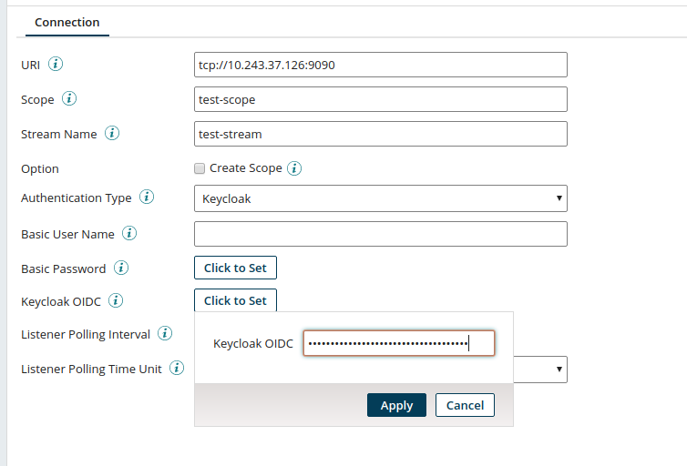

# Getting Started with the Pravega Connector

**Overview**

Pravega is a storage system that exposes Stream as the main primitive for continuous and unbounded data. A Pravega stream is a durable, elastic, append-only, unbounded sequence of bytes having good performance and strong consistency.

**Configure the Pravega Connector**

The Pravega connection represents and contains all the information that is needed to connect to and log in to a
 specific Pravega server. In this example we will create a new Pravega Connection. 
 At first, we need to start Pravega. [Here](http://pravega.io/docs/latest/deployment/run-local/) is 
 the documentation about how to run Pravega locally. We need to provide a URI endpoint of the Pravega controller
  in the form tcp://host:port, scope and stream name. If Basic authentication required, then Pravega username and password. If Keycloak authentication required for SDP support, then a valid Keycloak OIDC JSON installation file, including Keycloak endpoint and credentials. This is obtained from the Keycloak server.Then we need to provide listener time interval and time unit. We can check the connection using the Test Connection button.

Here we start a Pravega stand-alone in 9090 port. We provide a scope, stream name and check the option to create this scope. We also provide Listener polling interval and time unit.

Here we start a SDP Pravega  in 9090 port. We provide a scope, stream name and uncheck the option to create this scope. We provide the Keycloak OIDC JSON installation file content. We also provide Listener polling interval and time unit.
**Create a Write Operation**

Write is an outbound action to write streaming data in Pravega. Here is an example to create a write operation. We need to specify which routing key type we will use. &quot;Fixed&quot; means to use the literal value of the Routing Key. For example if we provide &quot;foo&quot; as a fixed Routing key, then &quot;foo&quot; will be used for every event.&quot;JsonReference&quot; means the event data is JSON and the value will be extracted from the body using the Routing Key as a JSON reference (i.e. a value of &quot;myVar&quot; will look for the &quot;myVar&quot; key in the JSON of each event, and use its corresponding value as the routing key for that event).

Here we used Fixed Routing key and our fixed key &quot;test-v2&quot;. So, for every event &quot;test-v2&quot; will be a routing key.

**Create a Read Operation**

Read is an inbound action to read the streaming data from Pravega. Each event that is read from the stream is passed on as a data document.  Here is an example how to create a read operation. We can use &quot;Head&quot; or &quot;Tail&quot; as an Initial Reader Group Position. The initial position from which to start reading from the stream. A value of &quot;Head&quot; means the first time the reader runs, it will read from the head (beginning) of the stream. So, this will read the entire stream from start to finish and may cause a very high load while doing so. A value of &quot;Tail&quot; means the first time the reader runs, it will start reading from the tail (end) of the stream. Use this option to start reading real-time events but be aware that all events that were written before the first process execution will be ignored. We need to provide Read Timeout which is the maximum amount of time the reader will wait for the next event from Pravega (in milliseconds). We also need to provide Max Events per Execution, which is for each execution of the operation, the maximum number of events the reader will read before moving to the next component in the process. Finally, we need to provide Max Read Time per Execution,s which is for each execution of the operation, the maximum number of seconds the reader will read and collect events from the stream before moving to the next component in the process.

Here we provide &quot;boomi-reader&quot; as a Reader Group name. We provide &quot;Tail&quot; as an Initial Reader Group Position which means reading from the tail(end) of the stream. 2000 milliseconds Read Timeout, so reader will wait for 2000 milliseconds for the next event from Pravega. 100K as the Max Events per Execution, So the operation will read a maximum of 100000 events. If it hits the tail of the stream (no more events), or this limit (100000 events), it will exit execution and the collection of events will be sent to the next component in the process flow. Max Read Time per Execution is 30, So the operation will spend a maximum of 30 seconds reading events from the stream. If it hits the tail of the stream (no more events), or this time (30 seconds), it will exit execution and the collection of events will be sent to the next component in the process flow.

**Create a Listen Operation**

Listen operation is also an inbound action to read the streaming data from Pravega.  Each event that is read from the stream will be passed on as a data document submitted to the listener. Here is an example of how to create a listen operation. We need to provide a Pravega reader group name and an initial reader group position. We can use &quot;Head&quot; or &quot;Tail&quot; as an Initial Reader Group Position. The initial position from which to start reading from the stream. A value of &quot;Head&quot; means the first time the reader runs, it will read from the head (beginning) of the stream. So, this will read the entire stream from start to finish and may cause a very high load while doing so. A value of &quot;Tail&quot; means the first time the reader runs, it will start reading from the tail (end) of the stream. Use this option to start reading real-time events but be aware that all events that were written before the first process execution will be ignored

Here we provide &quot;test-v2&quot; as a Reader Group name. We provide &quot;Tail&quot; as an Initial Reader Group Position which means reading from the tail(end) of the stream

**Basic Read/Write Process Example**

The basic Read/Write Process Example starts with a No Data shape and a Branch. The first branch will write the test data into Pravega stream using Pravega Connection and Pravega Write Operation. The second branch will read from the Pravega Stream using the same Pravega connection but a read operation. We can run this process using the Test Button.

**Pravega Listen and Write Process Example:**

This process will start with a Listener Connection and a Listen Operation which will listen from Pravega Stream. Then the process will write this stream again in Pravega Stream using a different Pravega Connection and a Write Operation. Boomi is not support direct testing of listener process. We need to deploy this process in a test environment.

**Database Write Process Example:**

This example starts with a No Data shape and a Branch. The first branch will write the test data (JSON format) in into Pravega stream using Pravega Connection and Pravega Write Operation. The second branch will read from the Pravega Stream using the same Pravega connection but a read operation. Then we need to pass this data to a Map shape which will convert this JSON data to a database insert statement. Finally, we have need to use a Oracle Database Connection and a Write Operation to write this data into Oracle Database. We can test this process using the Test button.

